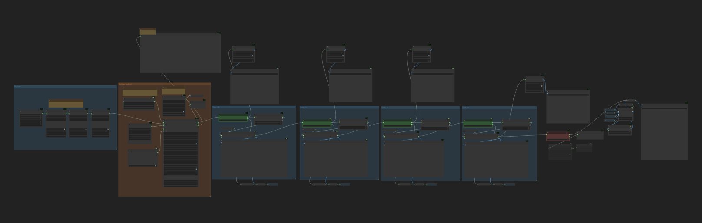
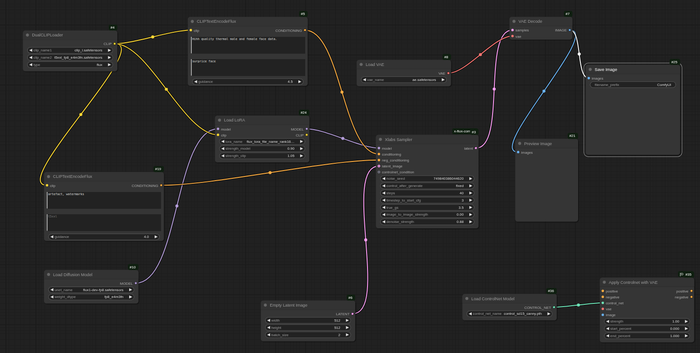
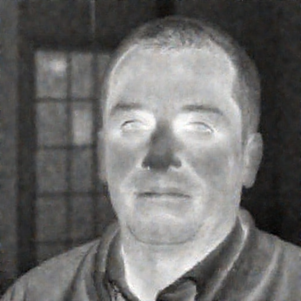
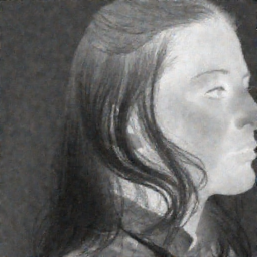

# ThermVision: Exploring FLUX for Synthesizing Hyper-Realistic Thermal Face Data and Animations via Image to Video Translation


**ThermVision** is a synthetically curated thermal imaging dataset designed to support research in facial analysis under infrared modalities. Unlike conventional thermal datasets captured through physical sensors, ThermVision leverages **FLUX diffusion models**—a class of high-fidelity generative architectures—to simulate photo-realistic thermal facial animations under controlled variations in head pose and facial expression.

The dataset is generated using a two-stage process:

1. **Thermal Domain Synthesis with FLUX Diffusion**  
   The core of this pipeline involves fine-tuning in the thermal domain using a FLUX diffusion model trained on various subsets of real-world thermal face mappings. This results in high-resolution synthetic thermal sequences that preserve realistic temperature gradients, structural fidelity, and dynamic consistency across frames.

2. **Video Retargeting Pipeline**  
   Clean visible-spectrum facial videos of male and female subjects are processed using a retargeting framework to extract motion dynamics including pose shifts, gaze changes, and facial expressions (e.g., smile, frown, surprise).

Each sample in ThermVision consists of:
- A sequence of synthetic thermal frames depicting continuous head movement or expression changes
- Corresponding pose and expression annotations
- Subject metadata (gender label, synthetic ID)

The dataset includes balanced representations of both male and female synthetic subjects, ensuring coverage across gender, expression types (neutral, smiling, surprised, etc.), and yaw/pitch/roll head rotations.

### 🧠 Applications Supported
- Thermal face detection and tracking  
- Infrared expression recognition  
- Facial animation learning in low-light or occluded scenarios

By eliminating the need for costly thermal video capture while retaining realism and controllability, **ThermVision** enables scalable and reproducible research in thermal vision, particularly useful for surveillance, defense, health diagnostics, and privacy-preserving facial analytics.

---

## 🔬 Project Overview

ThermVision synthesizes high-fidelity thermal facial animations of male and female subjects under varying expressions and head poses. Key highlights include:

- ⚙️ Video retargeting of pose/expression sequences  
- 🔥 FLUX-style diffusion-based thermal synthesis  
- 🎯 Targeted for thermal gender classification under realistic distortions

---

## 📁 Dataset Access

- [📥 ThermVision Sample Dataset](https://huggingface.co/datasets/MAli-Farooq/ThermVision-Sample-Dataset)  
- [📦 ThermVision Full Dataset (request access)](mailto:muhammadali.farooq@universityofgalway.ie)

---

## 🧩 ComfyUI Workflows

We provide two complete [ComfyUI](https://github.com/comfyanonymous/ComfyUI) workflows for training and inference:

| Workflow             | Preview                                               | JSON File Download |
|----------------------|--------------------------------------------------------|---------------------|
| **Training Pipeline** |         | [Download `training_workflow.json`](Workflows/flux_lora_train_thermal.json) |
| **Inference Pipeline**|       | [Download `inference_workflow.json`](Workflows/Inference_lora_workflow.json) |

These workflows demonstrate how thermal animation synthesis is achieved using our custom retargeting and diffusion-based generation steps.

---
## 🛠️ FLUX Training 
To re-tune the FLUX LoRA model please follow the below provided guide 
[Flux Trainer](https://github.com/MAli-Farooq/ComfyUI-FluxTrainer)

---

## 📊 ThermVision Evaluation and Annotations:

The Code folder in this repository contains the models and training/testing/inferencing scripts for 3 different tasks which includes
**Thermal Face Localization/Annotations**
**Thermal Gender Classification**
**Thermal Facial Landmarks Predictions**

---

## 📊 Thermal Gender Classification Results

We evaluated multiple backbone architectures under both pure synthetic and hybrid training regimes:


**Datasets**: Tufts, CARL, SF-TL54, Charlotte-ThermalFace  
**Models**: MobileNet_v2, EfficientNet_b0, ResNet

---

## ⚠️ Bad Sample Results

While the majority of our generated images are structurally sound and realistic, failure cases still occur due to limitations in retargeted motion or extreme pose variations:

| Failure Sample | Issue |
|----------------|-------|
|  | Thermal noise hallucination, unrealistic temperature map |
|  | Loss of facial structure under extreme yaw |

We are actively refining the synthesis stage and improving retargeting stability to minimize these issues.

---

## 📹 Vidoe Retargetting Module
Please find the below link to download and use the video retargetting module
- [Live Portrait](https://github.com/MAli-Farooq/LivePortrait)

## 📚 Paper & Citation

- [📄 Read on arXiv](https://arxiv.org/abs/your-paper-id)

**BibTeX:**
```bibtex
@inproceedings{
2025thermvision,
title={ThermVision: Exploring {FLUX} for Synthesizing Hyper-Realistic Thermal Face Data and Animations via Image to Video Translation},
author={Farooq, Muhammad Ali and Shariff, Waseem and Corcoran, Peter},
booktitle={ACM Multimedia 2025},
year={2025},
url={https://openreview.net/forum?id=iNKiMnIl1K},
volume={},
number={},
pages={},
doi={}       
}
